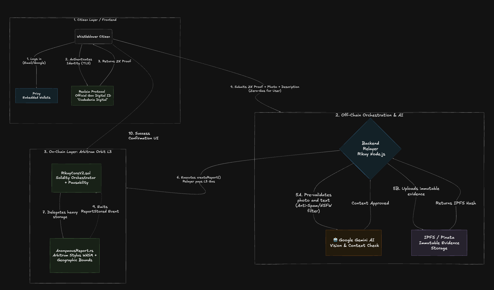

<div align="center">

# Rikuy

**The Anonymous, Zero-Knowledge Whistleblowing Network**

[](https://arbitrum.io/)
[-red?style=for-the-badge&logo=rust)](https://docs.arbitrum.io/stylus/stylus-gentle-introduction)
[](https://reclaimprotocol.org/)
[](https://privy.io/)
[](./test/)

*Empowering citizens to report corruption safely, securely, and immutably.*

</div>

---

## The Problem

In many developing nations, specifically in Latin America, reporting corruption or public infrastructure failures is a dangerous and bureaucratic nightmare. According to Transparency International's Corruption Perceptions Index (CPI), countries like **Bolivia (ranked 140/180 with a score of 26/100 in 2024)** and **Mexico (score of 31/100 in 2023)** are among the most negatively perceived in the world regarding public sector corruption.

Citizens in these environments face:

1. **Fear of Retaliation:** Whistleblowers are often exposed, leading to political or physical retaliation.
2. **Bureaucratic Friction:** Filing formal transparency reports (e.g., *Ley 974* in Bolivia) requires physical presence, identifiable paperwork, and endless negotiation.
3. **Data Manipulation:** Evidence of corruption often "disappears" from centralized government or police servers before investigations conclude.

---

## The Solution: Rikuy

**Rikuy** (Quechua for "To See" / "To Observe") is a trustless, decentralized platform that guarantees **100% anonymity** for whistleblowers while ensuring **100% Sybil-resistance** (one real citizen = one report capability).

By leveraging Zero-Knowledge Proofs, an Arbitrum L3 AppChain, and AI pre-validation, Rikuy creates an immutable ledger of civic reports that cannot be censored, altered, or traced back to the user.

---

## System Architecture

<div align="center">



</div>

---

## Key Features

| Feature | Description |
| :--- | :--- |
| **Absolute Anonymity via ZK-Proofs** | **Reclaim Protocol** verifies a citizen's official digital identity (Ciudadania Digital) without ever extracting their name, ID number, or personal data. |
| **Zero-Gas, Seamless UX** | Powered by **Privy** embedded wallets and a custom backend Relayer, citizens never see a crypto wallet, never buy tokens, and never pay gas fees. |
| **AI-Powered Triaging** | **Google Gemini AI** pre-validates all photographic evidence and descriptions before allowing on-chain submission, preventing spam and NSFW content. |
| **High-Performance Contracts** | Smart contracts written in **Rust** using **Arbitrum Stylus** (WASM) and deployed on our own **Arbitrum Orbit L3 AppChain** for sub-cent transaction costs. |
| **Legal Validity** | Reports are hashed and stored on **IPFS**, generating an immutable cryptographic timeline valid for legal audits under anti-corruption frameworks. |
| **Community Validation** | Citizens can upvote/downvote reports. After reaching a threshold, reports are auto-verified and forwarded to government entities for resolution. |

---

## User Flow

Rikuy completely abstracts Web3 complexities from the end user:

```
User Login (Privy)  -->  ZK Citizenship Proof (Reclaim)  -->  Submit Report + Photo
       |                          |                                    |
  Embedded Wallet            On-chain commitment                  Gemini AI validates
  (invisible)                (no PII stored)                      evidence & description
                                                                       |
                                                              IPFS Upload (Pinata)
                                                                       |
                                                              Gasless On-Chain Tx
                                                              (Relayer pays L3 gas)
                                                                       |
                                                              Stylus Contract stores
                                                              metadata + IPFS hash
```

1. **Onboarding:** User logs in with Email/Google via **Privy** (invisible embedded wallet created).
2. **ZK Verification:** User authenticates via the government portal. **Reclaim Protocol** generates a ZK proof of citizenship. The Relayer registers this commitment on-chain.
3. **Reporting:** User uploads photographic evidence and a description of the incident.
4. **AI Validation:** The backend uses **Gemini AI** to verify photo-description coherence and filter spam/NSFW.
5. **Immutable Storage:** The payload is uploaded to **IPFS** via Pinata.
6. **Gasless Submission:** The backend **Relayer** constructs a transaction with a unique nullifier (preventing double-reporting) and pays the L3 gas.
7. **On-Chain Execution:** The **Rust (Stylus)** contract logs the report metadata and IPFS hash on the Rikuy L3 chain.

---

## Technology Stack

| Layer | Technology | Purpose |
| :--- | :--- | :--- |
| **Blockchain** | Arbitrum Orbit L3 (Chain ID: 313370) | Custom AppChain for ultra-low costs and isolated state |
| **Smart Contracts** | Rust (Stylus) + Solidity (UUPS Proxies) | High-performance WASM contracts with upgradeable Solidity orchestration |
| **Identity / ZK** | Reclaim Protocol | Zero-Knowledge proofs for government ID verification |
| **Authentication** | Privy | Web2-style login mapped to secure Embedded Wallets |
| **Storage** | IPFS (Pinata) | Decentralized, immutable storage for photographic evidence |
| **AI** | Google Gemini Vision | Automated spam prevention and evidence context validation |
| **Backend** | Node.js, Express, Ethers.js | API Gateway, Gas Relayer, and EXIF metadata stripping |
| **Frontend** | React, Vite, HeroUI, viem | Responsive citizen-facing application |
| **Testing** | Foundry (forge) | 73 on-chain tests with fuzz testing (256+ runs) |
| **Infrastructure** | Docker, systemd, Traefik | 24/7 L3 node and backend on dedicated VPS |

---

## Smart Contract Architecture

Rikuy uses a **cross-language contract architecture** combining Solidity and Rust (Stylus):

```
┌─────────────────────────────────────────────────────┐
│                   RikuyCoreV2.sol                    │
│              (UUPS Upgradeable Proxy)                │
│    Orchestrator: roles, validation, resolution       │
├──────────────────────┬──────────────────────────────┤
│                      │                              │
│  ┌───────────────────▼───────────┐  ┌──────────────▼──────────────┐
│  │     ReportRegistry.sol        │  │   AnonymousReport.rs        │
│  │     (UUPS Proxy)              │  │   (Stylus / WASM)           │
│  │                               │  │                             │
│  │  - Nullifier tracking         │  │  - Commitment storage       │
│  │  - Validation scores          │  │  - Geo-bounds enforcement   │
│  │  - Report metadata            │  │  - Content hash storage     │
│  │  - Resolution state           │  │  - Nullifier enforcement    │
│  └───────────────────────────────┘  └─────────────────────────────┘
│
│  ┌───────────────────────────────┐  ┌─────────────────────────────┐
│  │   CitizenZkVerifier.sol       │  │  GovernmentRegistry.sol     │
│  │                               │  │                             │
│  │  - Reclaim proof verification │  │  - Government entity mgmt   │
│  │  - Anti-Sybil (1 wallet:1 CI)│  │  - Department registration  │
│  │  - CI hash → wallet mapping   │  │  - Activation / deactivation│
│  └───────────────────────────────┘  └─────────────────────────────┘
```

### Anonymity Model

```
commitment = keccak256(wallet_address + SALT + nonce)
```

The `SALT` is a server-side secret never exposed to the client. This ensures that even if the blockchain is fully transparent, **no observer can reverse-engineer which wallet submitted which report**.

---

## Test Suite

All smart contracts are tested with **Foundry** (forge), including unit tests, integration tests, and fuzz testing:

```
$ forge test

[PASS] RikuyCoreV2Test ............................ 17 tests
[PASS] ReportRegistryTest ......................... 18 tests
[PASS] GovernmentRegistryTest ..................... 15 tests
[PASS] CitizenZkVerifierTest ...................... 13 tests
[PASS] Fuzz Tests (256 runs each) .................  2 tests

Total: 73 tests passed | 0 failed
```

| Contract | Tests | Coverage |
| :--- | :--- | :--- |
| **RikuyCoreV2** | 17 | Initialization, report lifecycle, validation, resolution, access control, UUPS upgrade |
| **ReportRegistry** | 18 | Storage, nullifier enforcement, validation scores, resolution, index queries, fuzz bounds |
| **CitizenZkVerifier** | 13 | ZK proof verification, anti-Sybil (1 wallet : 1 CI), admin functions, edge cases |
| **GovernmentRegistry** | 15 | Registration, activation/deactivation, access control, full lifecycle |

Mock contracts simulate the Stylus (Rust/WASM) layer and Reclaim Protocol verifier for deterministic testing in a pure Solidity environment.

---

## Live Infrastructure

Rikuy runs on a dedicated VPS with 24/7 uptime:

| Service | Endpoint | Status |
| :--- | :--- | :--- |
| **Rikuy L3 RPC** | `http://77.42.69.104:8449` | Running (Docker, auto-restart) |
| **Backend API** | `http://77.42.69.104:3001` | Running (systemd service) |
| **Frontend** | [rikuyapp.com](https://rikuyapp.com) | Deployed |

Chain ID: **313370** | Nitro Node: **v3.9.3**

### Deployed Contracts (Rikuy Chain L3 — Chain ID 313370)

| Contract | Address | Type |
| :--- | :--- | :--- |
| **RikuyCoreV2** (Proxy) | `0x61FC4578863DA32DC4e879F59e1cb673dA498618` | UUPS Proxy (Solidity) |
| **ReportRegistry** (Proxy) | `0x1b8E378f489021029b4e9049F261B204Def16974` | UUPS Proxy (Solidity) |
| **GovernmentRegistry** | `0x098FF07f87C1AAec0dD5b16c2F0199aA2b60bB75` | Solidity |
| **AnonymousReport** | `0x219284CFEE97741AEd3E3A7d193c1c1F360a780D` | Solidity (IAnonymousReport) |

---

## Documentation & Resources

- **[Strategic Roadmap](./docs/ROADMAP.md)** — Phased go-to-market plan aligned with Bolivia's 2026 elections
- **[Business Model (PDF)](https://drive.google.com/file/d/15qj4aNVQLQ-gmvLMBlShCQp_MtKOij5b/view?usp=sharing)** — Sustainability and go-to-market strategy
- **[One-Pager for Users (PDF)](https://drive.google.com/file/d/1Jf4-pC_qPYkQlGBYohBxpfnUHj4rCeMB/view?usp=sharing)** — High-level citizen experience overview
- **[Policy Brief](./docs/policy_brief.md)** — Document aimed at political candidates for modernizing transparency
- **[Frontend Integration Guide](./docs/FRONTEND_INTEGRATION.md)** — Developer handoff documentation

---

## Project Structure

```
rikuy/
├── contracts/
│   ├── solidity/
│   │   ├── core/           # RikuyCoreV2, ReportRegistry
│   │   ├── zk/             # CitizenZkVerifier, Reclaim lib
│   │   ├── governance/     # GovernmentRegistry
│   │   └── interfaces/     # IAnonymousReport, IReportRegistry
│   └── stylus/
│       └── src/lib.rs      # AnonymousReport (Rust/WASM)
├── backend/
│   └── src/
│       ├── services/       # relayer, report, identity, AI, IPFS
│       ├── routes/         # API endpoints
│       └── middleware/     # auth, rate limiting, validation
├── frontend/
│   └── src/
│       ├── pages/          # Landing, Denuncia, Map, Comunidad
│       ├── components/     # Reclaim verification, avatars, map
│       └── services/       # report submission, ZK proofs
├── test/                   # Foundry tests (73 passing)
├── script/                 # Deployment scripts (Forge)
└── docs/                   # Architecture, policies, guides
```

---

## Sponsor Technology Usage

| Sponsor | Integration | Impact |
| :--- | :--- | :--- |
| **Arbitrum Orbit** | Custom L3 AppChain (Chain ID 313370) | Dedicated chain with sub-cent gas costs for civic reports |
| **Arbitrum Stylus** | `AnonymousReport.rs` — core storage contract in Rust/WASM | 10x gas efficiency over equivalent Solidity for compute-heavy operations |
| **Reclaim Protocol** | ZK citizenship verification via Ciudadania Digital | Sybil-resistant identity without exposing any personal data |
| **Privy** | Embedded wallets + social login | Complete Web3 abstraction — users never interact with wallets or gas |

---

## Roadmap

Rikuy's go-to-market strategy is timed around Bolivia's **subnational elections (March 22, 2026)**, creating a unique window where both citizens and political candidates demand transparency infrastructure.

| Phase | Timeline | Objective | Key Milestone |
| :--- | :--- | :--- | :--- |
| **Phase 1 — Community Launch** | March 2026 | Build brand awareness and citizen user base before elections | 200 verified citizens, 50K ad impressions |
| **Phase 2 — Institutional Engagement** | March - April 2026 | Convert government contacts into pilot agreements | 1 signed Enterprise pilot (3-month free trial) |
| **Phase 3 — First Revenue** | May - July 2026 | Validate product-market fit with paying B2B customers | $500 MRR across RIKUY Connect + Insights |
| **Phase 4 — Scaling** | Aug - Dec 2026 | Expand to 7 cities, launch mobile app, apply for grants | $2,000 MRR, 1,000 verified citizens |
| **Phase 5 — Regional Expansion** | 2027 | Financial sustainability and expansion to Peru/Mexico | $5,000 MRR, 5,000+ citizens |

### Completed (Technical Foundation)

- [x] Arbitrum Orbit L3 AppChain deployed and operational (Chain ID 313370)
- [x] Cross-language smart contract architecture (Solidity + Rust/Stylus)
- [x] ZK citizenship verification via Reclaim Protocol (Ciudadania Digital)
- [x] Gasless UX with Privy embedded wallets and backend Relayer
- [x] AI-powered evidence validation (Google Gemini Vision)
- [x] Immutable evidence storage on IPFS (Pinata)
- [x] Community validation system (upvote/downvote with auto-verification threshold)
- [x] Government resolution workflow
- [x] 24/7 L3 node and backend infrastructure on dedicated VPS
- [x] Comprehensive test suite (73 tests with fuzz testing)

### In Progress

- [ ] $200 targeted social media campaign (Instagram, TikTok, Facebook) across 4 key cities
- [ ] Pilot deployment with municipal/gubernatorial candidates in Bolivia
- [ ] Governance DAO for decentralized report resolution
- [ ] Mobile application (React Native)

> Full strategic roadmap with revenue projections, grant strategy, and risk analysis: **[docs/ROADMAP.md](./docs/ROADMAP.md)**

---

## Real-World Adoption

Rikuy is not a prototype — it is a **live platform with active institutional interest**. The team is in direct conversations with **gubernatorial and mayoral candidates** running in Bolivia's upcoming subnational elections (March 22, 2026) who seek to implement Rikuy as a transparency tool within their administrations.

Active discussions are underway in:

- **Santa Cruz de la Sierra** — Gubernatorial and municipal candidates
- **La Paz** — Municipal candidates
- **Sucre** — Gubernatorial candidates
- **Tarija** — Municipal candidates

The timing is strategic: candidates actively seek differentiation tools that demonstrate commitment to anti-corruption. Rikuy offers them **real-time territorial intelligence** on citizen complaints, backed by verifiable blockchain data.

### Business Model

Rikuy operates as a **B2B SaaS platform** with two revenue products:

| Product | Description | Pricing |
| :--- | :--- | :--- |
| **RIKUY Connect** | Marketplace where lawyers, journalists, and NGOs publish case interest. Citizens choose who to engage. | $15 - $80/mo |
| **RIKUY Insights** | Data intelligence platform with heat maps, territorial analytics, and exportable reports. | $49 - $800+/mo |

> Full pricing structure and Business Model Canvas: **[Business Model (PDF)](https://drive.google.com/file/d/15qj4aNVQLQ-gmvLMBlShCQp_MtKOij5b/view?usp=sharing)**

---

<div align="center">

**Built for a more transparent future.**

*Rikuy — Arbitrum Open House NYC Buildathon 2026*

</div>
